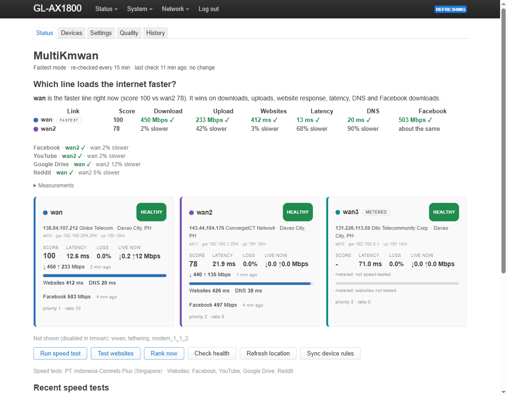
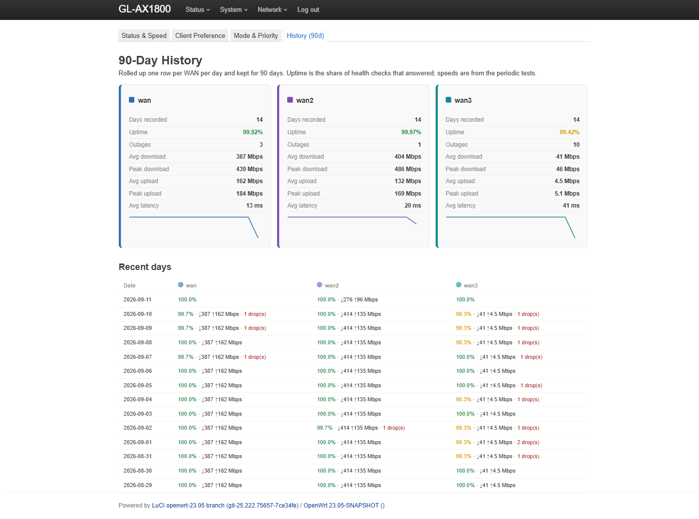
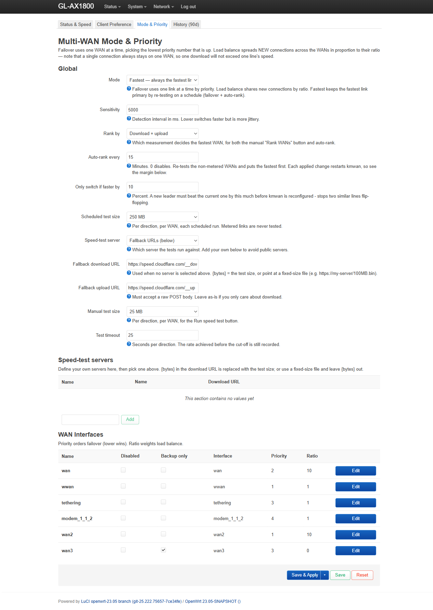
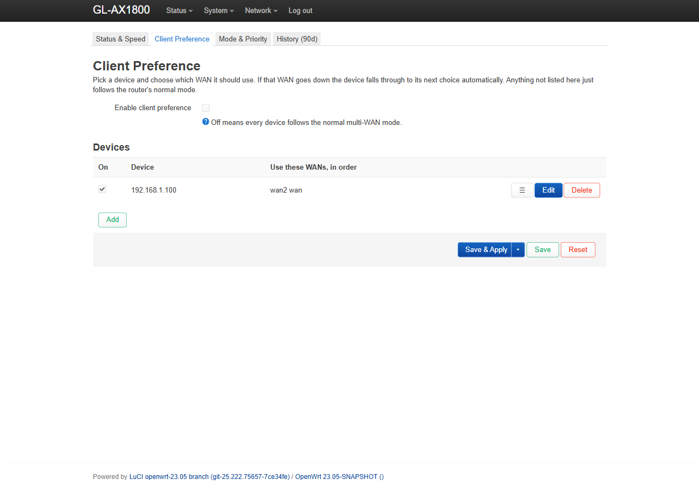

# MultiKmwan

**A LuCI web UI for GL.iNet's built-in multi-WAN engine (`kmwan`).** It lets you switch between failover, load-balance, and a "fastest" mode; give individual LAN devices a preferred WAN (a specific order, or a role that follows measurements: fastest, slowest, or backup); speed-test each line (against a public server or your own), time DNS lookups and real page loads over each line, and auto-rank the best with hysteresis so it doesn't flap; flag metered links as backup-only; and keep 90 days of per-WAN uptime, outage and speed history — all by driving the stock `kmwan` module rather than replacing it, so nothing about your GL.iNet setup is forked or lost.

| Status | History |
|---|---|
|  |  |

| Settings | Devices |
|---|---|
|  |  |

## Install

LuCI on GL.iNet is on **port 8080**. Download the `.ipk` from [Releases](../../releases):

```sh
scp luci-app-multikmwan_*.ipk root@192.168.8.1:/tmp/
ssh root@192.168.8.1 "opkg install /tmp/luci-app-multikmwan_*.ipk"
```

Then open **Network → MultiKmwan** (tabs: Status, Devices, Settings, Quality, History). Links that are disabled in kmwan are not shown on the Status page; a footnote lists them. Requires a GL.iNet 4.x device with `kmwan` and LuCI; the package is architecture-independent.

**Tested on:** GL-AX1800 (Flint), OpenWrt 23.05 / GL SDK4, `kmwan` 5.4.164, with three wired WANs.

## Documentation

Full docs — features, configuration, CLI, how it works, building from source, and FAQ (including "how do I use speedtest.net?") — are in the **[Wiki](../../wiki)**.

**New in 1.1.0: Quality**

- An independent background monitor continues collecting while speed tests, geolocation and routing jobs run.
- The new Quality page shows 1-hour / 24-hour latency and connection-state timelines, batch jitter, sampled packet loss, freshness, coverage, and outage/recovery events.
- Missing or stale observations are unknown. Disabled WANs are not counted as failures. Configured WANs remain visible when their device disappears.
- Today's daily totals appear immediately in History. Recent details are bounded in RAM (up to 24 hours, 16,384 samples and 512 events) and reset on reboot; the existing daily history is checkpointed hourly.
- Speed tests identify the selected profile, manual/scheduled type, actual download/upload destination hosts (including redirects), and per-direction success/failure. Profile labels are saved at measurement time. The last 256 attributed results are checkpointed hourly and shown in History; a sudden power loss can lose the newest results. URL paths, query tokens and credentials are excluded from recorded attribution.
- HTTP errors and incomplete transfers cannot be ranked as successful tests. Busy-link skips retain the original timestamp and do not add duplicate history samples.

The first configured `kmwan` probe target is used per IPv4 WAN. An unresponsive target is evidence of a probe failure, not proof of a whole-ISP outage. Gaps longer than three configured intervals are excluded from coverage and cannot establish a recovery duration. Failures shorter than the probe interval may go undetected. Jitter is the mean absolute difference between successive successful RTTs within each three-ping batch. Degradation currently means any packet loss or mean RTT above 250 ms.

Test results are HTTP transfer measurements made by MultiKmwan against the displayed cloud service or custom endpoint; they are not official Cloudflare or Ookla scores. Old results without attribution are labeled as unrecorded. Daily speed aggregates can mix sources. Monitoring does not change routing based on quality in this release.

**New in 1.1.0: "Fastest" now means fastest to use, not just fastest to download**

A link with the most Mbps can still feel slow if its round trips are long, its resolver is sluggish or the big CDNs are far away. The Fastest mode, the "Rank WANs now" button and the Fastest / Slowest client roles therefore rank links by a composite score, on by default:

- **Throughput** (download + upload, or one direction, as before) from the speed test.
- **Website response**: over each WAN, one HTTPS fetch of each test page, recording time to first byte and full page time. Default pages are Facebook, YouTube, Google Drive and Reddit; change them on the Settings page. Redirects count as a response, so a login or consent page is fine.
- **Latency**: the mean ping round trip to each link's probe target over the last 5 minutes, taken from the background monitor's samples (no extra traffic; the latest health probe stands in until the monitor has filled a window).
- **DNS lookup**: over each WAN, a DNS-over-HTTPS query for each page's hostname, timing only the query round trip. A plain UDP lookup goes through dnsmasq and leaves on whichever WAN the routing table prefers, so it cannot be attributed to one link; a DoH request bound to the device can. The answer is pinned for the page fetch, so the fetch measures that WAN alone rather than dnsmasq's cache.

Each component is the WAN's figure relative to the best WAN, weighted 40% throughput, 25% website response, 20% latency, 15% DNS (adjustable). Only pages that every link loaded are compared, so a page one link could not fetch cannot tilt the result; a link with no website result or no latency sample gets no credit for those components, and a component no link could measure drops out of the weighting. Choose "Throughput only" on the Settings page to get the old behaviour. The Status page shows each WAN's score (hover for the breakdown), DNS and first-byte times, a "Test websites" button and a per-site table. Auto-rank runs the website test right after the speed test; the auto-rank margin applies to the score. Existing installs switch to the composite on upgrade without any configuration change.

Website figures are measured from the router with curl, so they include the router's own TLS handshake time; that overhead is the same on every link and does not affect the ranking.

**Speed-testing a real site.** ISPs often give speedtest servers a fast lane that real content never gets, so a speed-test server profile can now be a **web page** instead of a file (Type: "Web page — its real content"). The test fetches the page, finds the scripts, styles and images it references, downloads each once as a browser would, then has the parallel streams pull the largest one repeatedly from the site's CDN, with connection reuse, until the test size is met. A "Facebook (real content)" profile is seeded. Every "Web page" profile is also measured during each website test and shown per line on the Status page (a "Facebook" column in the ranking table and a figure on each card), so you see who loads Facebook faster without changing the speed-test server. Pick it as the speed-test server on the Settings page and every speed test, auto-rank and the Fastest ranking measure what the lines deliver for Facebook instead (upload still uses the fallback URL). Add YouTube or any other site the same way. From the shell, `MK_SERVER=facebook multikmwan speedtest` runs one test against a profile without changing the configured server. On the test router the Ookla server reported 547 vs 495 Mbps for two lines while Facebook's CDN delivered 474 vs 539 Mbps, the other way round. Small test sizes understate real-content throughput because each stream starts cold; 25 MB per direction gives a fair figure.

Version 1.1.0 uses `flock` for crash-safe file locking. On OpenWrt and GL.iNet firmware that is a BusyBox applet, so nothing extra is needed and it is deliberately not a package dependency (GL.iNet's feeds do not carry the util-linux `flock` package, which would make this package uninstallable). The install script warns if `flock` is missing. BusyBox `flock` has no `-w` timeout, so waits are polled with `-n`. Note that the router's dropbear has no SFTP server, so a current OpenSSH `scp` needs `-O`:

```sh
scp -O luci-app-multikmwan_1.1.0-1_all.ipk root@192.168.8.1:/tmp/
ssh root@192.168.8.1 "opkg install /tmp/luci-app-multikmwan_1.1.0-1_all.ipk"
```

Build locally with Python 3 (Windows or Unix):

```sh
python build.py
python -m unittest discover -s tests -v
node --test tests/ui.test.js
python tests/check_package.py
```

The shell/AWK behavior tests use Git Bash on Windows and `/bin/sh` on Unix; the native locking test requires Linux with `flock`. Browser rendering can be previewed with synthetic data using `python tests/browser-preview.py`, then opening `build/preview.html`. The new release needs on-router validation of probe egress, resource use and service lifecycle on your GL.iNet firmware. See the [roadmap](docs/orb-feature-roadmap.md) for later diagnostics, alerts and quality-based routing work.

## ⚠️ Built by AI — read before you run it

This project was written by **Claude (Anthropic's AI)** in a single interactive session, developing directly against a live GL-AX1800 over SSH. A human directed it and it was tested on real hardware, but **no line was hand-written by a person.** It's networking code that runs as root on your router, so treat it accordingly:

- The source is **heavily commented with the reasoning** behind each non-obvious choice (why the `.ipk` is a tar.gz not an `ar`, why history uses an in-RAM accumulator, why `kmwan` only has two real modes, etc.) — read those comments; they are the design docs.
- Review the shell and JS yourself, or have someone you trust do so, before deploying on a network you care about.
- It's released into the public domain (below), with **no warranty** — you own the outcome.

If that trade-off isn't for you, that's completely fair.

## License

Public domain — [the Unlicense](LICENSE). Do whatever you want; no conditions, no attribution required.
