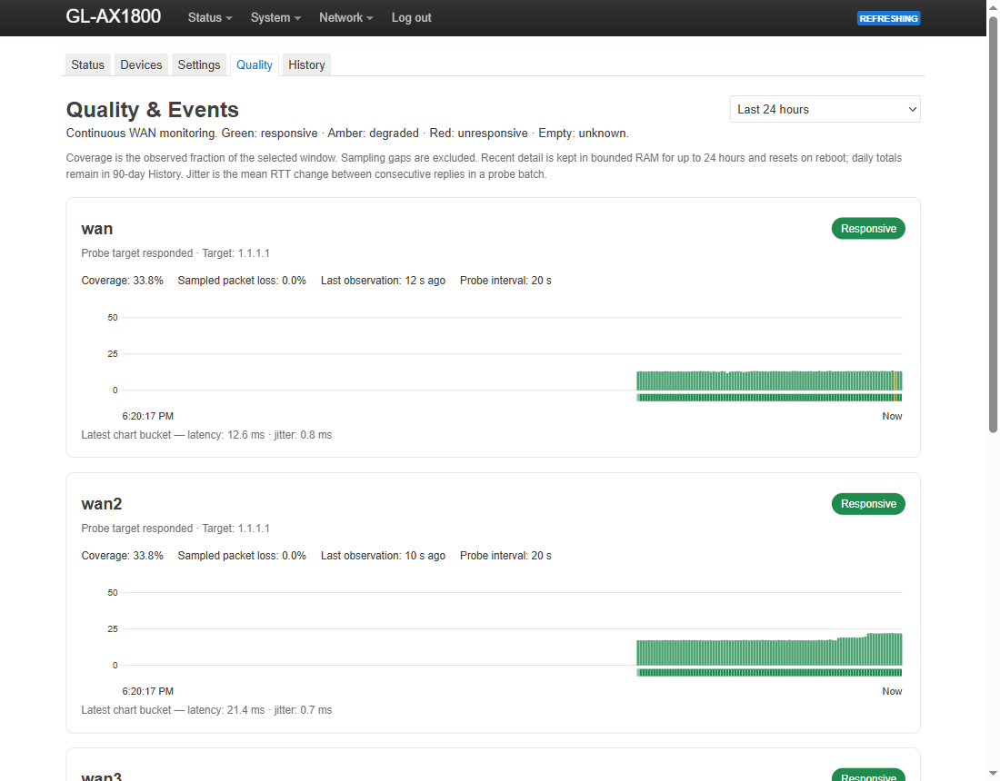

# MultiKmwan

A LuCI page for GL.iNet's built-in multi-WAN (`kmwan`). It tells you which line is faster for real use, not just on a speed test: throughput, how fast real websites answer, latency and DNS, measured over each line from the router. It keeps the best line primary, lets you pin devices to a line, and keeps 90 days of history.

| Status | Quality |
|---|---|
|  |  |

## Install

Grab the `.ipk` from [Releases](../../releases), then (LuCI is on port 8080; the router's `scp` needs `-O`):

```sh
scp -O luci-app-multikmwan_*.ipk root@192.168.8.1:/tmp/
ssh root@192.168.8.1 "opkg install /tmp/luci-app-multikmwan_*.ipk"
```

Open **Network → MultiKmwan**. Needs a GL.iNet 4.x router with `kmwan`. Tested on a GL-AX1800.

## What it does

- **Fastest mode** keeps the best line primary. Lines are scored on throughput (40%), website response (25%), latency (20%) and DNS (15%), re-tested every 15 minutes, with a switching margin so two similar lines never flap. Failover and load-balance modes are there too.
- **Real-content speed tests.** A speed-test server can be a web page (Facebook is included): the test pulls the site's own assets from its CDN, so you see what a line delivers for real content rather than a speedtest fast lane. Ookla and custom servers work as before.
- **Devices.** Pin any LAN device to a line, an order of lines, or a role that follows the measurements: fastest, slowest or backup.
- **Quality and History.** Continuous latency, jitter, loss and outage timeline per line, plus 90 days of uptime and speed.
- **Safe by default.** Metered links are never tested and stay backup-only; busy links are skipped rather than measured under load; a failed transfer is retried and can never flip routing by itself.
- **Privacy toggle** on every tab for shareable screenshots.

How it works and the changelog: [release notes](../../releases) and the [wiki](../../wiki).

Build and test: `python build.py`, `python -m unittest discover -s tests`, `node --test tests/ui.test.js`.

## Built by AI

Written by Claude (Anthropic) against a live router, directed and tested by a human. It runs as root on your router: read it before you trust it. Public domain, no warranty ([Unlicense](LICENSE)).
